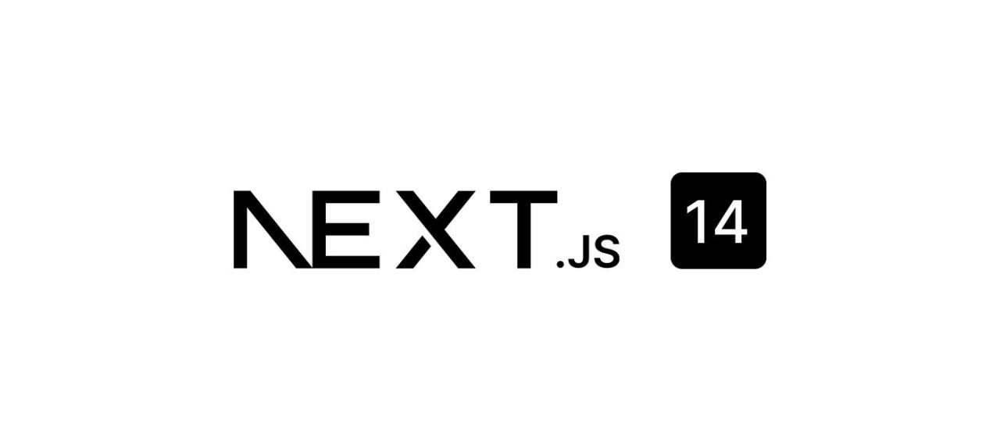
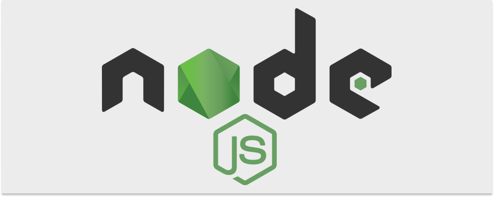
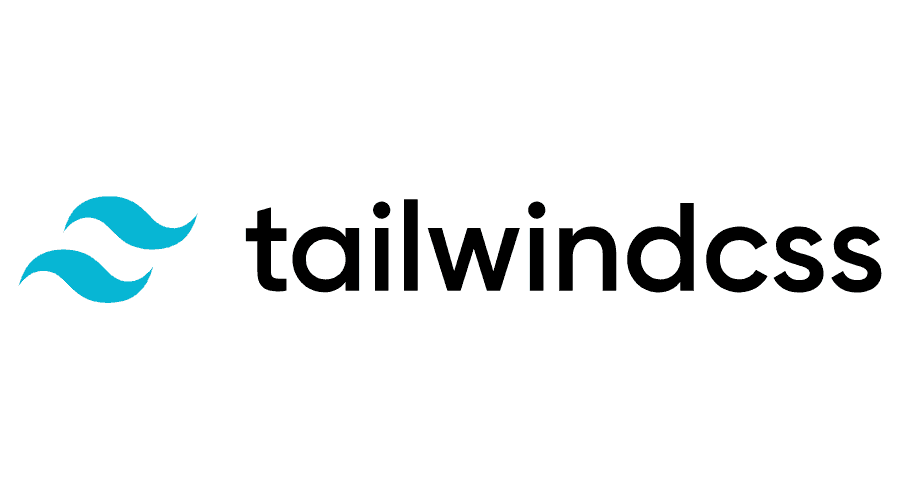
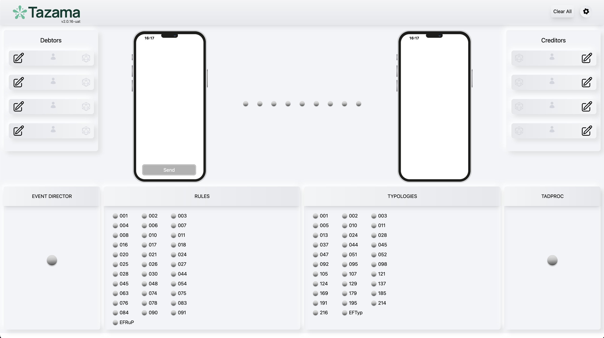
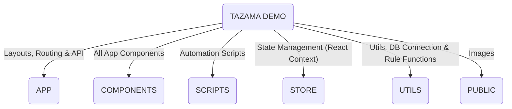

 </br>

![typescript][typescript]   

# Tazama Demo Application</br>

> [!Important]
> **[`Tazama`](https://tazama.org/index.html)** This repo is not intended for end users. Please refer to  **[Full-Stack-Tazama-Docker](https://github.com/tazama-lf/Full-Stack-Docker-Tazama)** repo.

> [!NOTE]
> **[`Tazama`](https://tazama.org/index.html)** Open Source Real-Time Transaction Monitoring Software for Fraud and Money Laundering Detection

![GitHub License][github-license-badge] </br>

>
Welcome to the Tazama Demo Application. This demo app is used to demo the Tazama Open Source Real-Time Transaction Monitoring System built to support any Financial Services Provider (FSP) that requires Transaction Monitoring for Fraud and Money Laundering detection. Whether that FSP is a small provider running one or 2 transactions per day or a national payment switch running at over 3,000 Transactions per second. With Tazama they can implement simple or complex rules, implement Fraud Detection controls or support Anti-Money Laundering activities. 🌍

[Usage Docs](https://github.com/tazama-lf/docs/blob/dev/Guides/demo-ui-guide.md)

## Requirements

What you need:

-  **[Full-Stack-Tazama-Docker](https://github.com/tazama-lf/Full-Stack-Docker-Tazama)** - Setup the Rules and Typologies Using Docker Compose from the Tazama Repository. Follow the instructions in the readme.md
- 💻 **[Demo UI](#)** - Clone this repository and use the easy to setup UI to demo the Tazama Open Source Real-Time Transaction Monitoring System that dynamically builds the UI based on the configured rules and typologies

## Table of Contents

- [Tazama Demo Application](#tazama-demo-application)
  - [Requirements](#requirements)
  - [Table of Contents](#table-of-contents)
  - [Getting Started](#getting-started)
    - [Local Setup](#local-setup)
    - [Network Setup](#network-setup)
    - [Setup UI](#setup-ui)
    - [End-to-End Tests](#end-to-end-tests)
  - [Tag and Release](#tag-and-release)
    - [Versioning](#versioning)
    - [Tag, Build and Push to Docker Hub](#tag-build-and-push-to-docker-hub)
    - [Reverting version changes if the build fails](#reverting-version-changes-if-the-build-fails)
    - [Create Docker Image for Dev Testing](#create-docker-image-for-dev-testing)
  - [Application Structure \& Documentation Links](#application-structure--documentation-links)
    - [Overview](#overview)
    - [Chart](#chart)
    - [Folder Structure](#folder-structure)
    - [Package Documentation Links](#package-documentation-links)
  - [License](#license)
  - [Contributors](#contributors)

## Getting Started

### Local Setup

To get started by running the demo locally, follow these steps:

1. Fork & clone repository:

**Don't forget to ⭐ star and fork it first :)*

`ssh method`

```bash
git clone git@github.com:tazama-lf/tazama-demo.git
```

or

`https method`

```bash
git clone https://github.com/tazama-lf/tazama-demo.git
```

1. Setup

```bash
add your GH_TOKEN to the .npmrc file ${GH_TOKEN}
```

3. Install the dependencies:

```bash
npm install
```

4. Create a `.env` file from the template:

```bash
cp .env.template .env
```

`.env.template` is the committed reference for all supported environment variables with inline comments. Copy it to `.env` and fill in the values for your environment. The `.env` file itself is git-ignored and must never be committed.

**Required - server-to-server service URLs (never exposed to the browser):**

| Variable | Purpose | Example |
|---|---|---|
| `NATS_SERVER_URL` | NATS messaging server used by the custom Node server for real-time transaction streaming. Must be reachable from the server process - not the browser. | `nats://192.168.1.10:4222` |
| `ADMIN_SERVICE_URL` | Tazama admin service. Used server-side by the BFF API routes (`/api/conditions/*`) to read and write conditions. Must not be a `NEXT_PUBLIC_` variable - it is a Docker-internal address unreachable from the browser. | `http://192.168.1.10:5100` |
| `TMS_SERVER_URL` | Tazama Transaction Monitoring Service. Used server-side to submit transactions. | `http://192.168.1.10:5000` |

**Optional - client-visible config (no credentials, safe to expose):**

| Variable | Default | Purpose | Example |
|---|---|---|---|
| `NEXT_PUBLIC_URL` | `http://localhost:3001` | Public base URL of this app. Used for OAuth redirect URIs and absolute URL construction. Change this when running behind a reverse proxy or on a non-default port. | `http://demo.example.com` |
| `NEXT_PUBLIC_WS_URL` | `http://localhost:3001` | WebSocket server URL. The custom Node server serves Socket.IO on this address. Must be reachable from the browser. | `http://demo.example.com` |

**Authentication (disabled by default):**

| Variable | Default | Purpose | Example |
|---|---|---|---|
| `AUTHENTICATED` | `false` | Set to `true` to require Keycloak OIDC login. When `false`, all other auth variables are ignored. | `true` |
| `AUTH_SERVICE_URL` | _(none)_ | Keycloak realm URL. Required when `AUTHENTICATED=true`. | `http://keycloak.example.com/realms/tazama` |
| `NEXTAUTH_SECRET` | _(none)_ | Secret used to sign Auth.js session tokens. Required when `AUTHENTICATED=true`. Generate with: `openssl rand -base64 32` | _(generated value)_ |

**Condition type dropdowns (optional overrides):**

| Variable | Default | Purpose | Example |
|---|---|---|---|
| `CONDITION_TYPES` | built-in list of 3 | JSON array of condition type strings shown in the condition creation dropdown. Leave commented to use the built-in defaults. | `["non-overridable-block","overridable-block","override"]` |
| `EVENT_TYPES` | built-in list of 4 | JSON array of event type strings for the condition event type filter. | `["pacs.008.001.10","pacs.002.001.12"]` |
| `CONDITION_REASONS` | built-in list of 18 | JSON array of reason strings shown in the condition reason dropdown. | `["Fraudulent Activity","Sanction Screening Exception"]` |

5. Run the development server:

```bash
npm run dev
```

6. Open [http://localhost:3001](http://localhost:3001) with your browser to see the result.

<a><div align="right">[Top](#table-of-contents)</div></a>

### Network Setup

1. Follow the **[Full-Stack-Tazama-Docker](https://github.com/tazama-lf/Full-Stack-Docker-Tazama)** setup guide.
2. Do not deploy the demo ui from Full-Stack-Tazama-Docker. Run demo ui locally `yarn dev`
<a><div align="right">[Top](#table-of-contents)</div></a>

### Setup UI

1. First Load

>  <br/>

<a><div align="right">[Top](#table-of-contents)</div></a>

### End-to-End Tests

The e2e tests use [Playwright](https://playwright.dev/) and run entirely without a live Tazama stack. The server starts automatically in `TEST_MODE`, intercepting transaction submissions and emitting deterministic fixtures over Socket.IO.

1. Install Playwright browsers (one-time, after `npm install`):

```bash
npx playwright install chromium
```

2. Run headless (CI-style):

```bash
npm run e2e:headless
```

To view the HTML report after a headless run:

```bash
npx playwright show-report
```

3. Run in UI mode (interactive, with step-by-step timeline and live browser):

```bash
npm run e2e:ui
```

No `.env` file is needed to run the tests - all required environment variables are injected by `playwright.config.ts`.

<a><div align="right">[Top](#table-of-contents)</div></a>

## Tag and Release

### Versioning

> Format: v2.2.0
> 
> Given a version number MAJOR.MINOR.PATCH, increment the:
>
> MAJOR version when you make incompatible API changes,
MINOR version when you add functionality in a backwards-compatible manner, and PATCH version when you make backwards-compatible bug fixes. Additional labels for pre-release and build metadata are available as extensions to the MAJOR.MINOR.PATCH format.

In this section the following script will update the `PATCH` version in the package.json file and update the docker-compose.dev.yml file.

<a><div align="right">[Top](#table-of-contents)</div></a>

### Tag, Build and Push to Docker Hub

1. From the root of the project directory run:

   ```bash
   sudo chmod +x ./tag.sh
   ```

2. When you are ready to create a new image, run `./tag.sh` from the command line.

   ```bash
   ./tag.sh
   ```
  
   > **This will build the Docker Image and Push it to Docker Hub*

<a><div align="right">[Top](#table-of-contents)</div></a>

### Reverting version changes if the build fails

If the build fails run the following script to revert changes made to the `docker-compose.dev.yml` and the `package.json` files.

1. From the root of the project directory run:

   ```bash
   sudo chmod +x ./revertTag.sh
   ```

2. When you are ready to create a new image, run `./tag.sh` from the command line.

   ```bash
   ./revertTag.sh
   ```

3. Fix the build issues and run the `./tag.sh` script again to Tag and Release the Demo

<a><div align="right">[Top](#table-of-contents)</div></a>

### Create Docker Image for Dev Testing

1. Build the Docker image

   ```bash
   COMPOSE_DOCKER_CLI_BUILD=1 DOCKER_BUILDKIT=1 docker compose -f docker-compose.dev.yml build
   ```

2. Tag the Docker Image

   ```bash
   docker tag tazamaorg/demo-ui:{version} tazamaorg/demo-ui:{version}-dev
   ```

   > **Note: Check The `docker-compose.dev.yml` file to see what the version will be and update above command by replacing {version} with eg. v2.2.0*
3. Push the image to docker hub

   If you want to push the Docker image to Dockerhub for a distribution and testing:

   ```bash
   docker push tazamaorg/demo-ui:{version}-dev
   ```

   > **Note: Check The `docker-compose.dev.yml` file to see what the version will be and update above command by replacing {version} with eg. v2.2.0*

4. To use the Docker Image in the **[Full-Stack-Tazama-Docker](https://github.com/tazama-lf/Full-Stack-Docker-Tazama)** stack, update the following:

    ```yaml
    services:
      app:
        container_name: tazama-demo
        image: tazamaorg/demo-ui:v2.2.0
        env_file:
          - .env
        volumes:
            - .:/app
            - /app/node_modules
            - /app/.next
        ports:
          - "3001:3001"
        restart: always
        networks:
          - network1

    networks:
      network1:
        name: tazama_default
        external: true
    ```

    > **Note: Check The `docker-compose.dev.yml` file to see what the version will be and update above command by replacing {version} with eg. v2.2.0*

<a><div align="right">[Top](#table-of-contents)</div></a>

## Application Structure & Documentation Links

### Overview

The Tazama Demo application is developed using NextJS 14 running a custom backend nodejs server. The Custom server allows the integration with NATS which communicates to the frontend with the use of SocketIO to stream data to the FE SocketIO-client.

The application manages state by using Context, Actions, Reducers and Providers for more global state but certain components also make use of React useState. Configuration data is persisted with localState as well as PACS008, PACS002, debtors and creditors data.

### Chart


```mermaid
flowchart TD
%% Nodes
    A("TAZAMA DEMO")
    B("APP")
    C("COMPONENTS")
    D("SCRIPTS")
    E("STORE")
    F("UTILS")
    G("PUBLIC")
    %% H("ROUTES & LAYOUT")
    %% I("APPLICATION COMPONENTS")

%% Edge connections between nodes
   A--"Layouts, Routing & API"-->B
   A--"All App Components"-->C
   A--"Automation Scripts"-->D
   A--"State Management (React Context)"-->E
   A--"Utils, DB Connection & Rule Functions"-->F
   A--"Images"-->G
```

### Folder Structure

- Tazama Demo - Base Folder:
  
  ```text
  Custom Server - Contains WebSocket and NATS Connections
  Package Management - Package.json
  ```

- App Folder:

  ```text
  Application Layout
  Main Page
  Handles navigation
  ```

- Components Folder:

  ```text
  Debtor & Creditor Profile Components
  Debtor & Creditor Devices Components
  Modals
  Rule Results Component
  Typology Results Component
  Status Indicator Component
  Time Component
  Loader Component
  ```

- Scripts Folder:

  ```text
  Automation Scripts used by tag.sh and revertTag.sh shell scripts for Automating Versioning and Build Tags (Docker & Application)
  The tag.sh script also builds and pushes the docker image to docker hub. 
  The revertTag.sh script will revert the version of the docker tag and application version to the previous build.
  ```

- Store Folder:

  ```text
  Application State Management.
  React Context is used for global state management
  Entities - Entities State and Local Storage Management
  Processor - Rule & Typology State Management
  ```

- Utils Folder:

  ```text
  Any Utilities for custom formatting, Looking up descriptions etc.
  Database connection and Queries.
  ```

- Public Folder:

  ```text
  All images used by the app.
  ```

<a><div align="right">[Top](#table-of-contents)</div></a>

### Package Documentation Links

- NATS - [NATS Documentation](https://docs.nats.io/?_gl=1*1k5gaq9*_ga*NjExNzA3MDcyLjE3MjAwNzQ5ODQ.*_ga_6242VH03CH*MTcyNzI1MjkyMy4yMy4wLjE3MjcyNTI5MjMuMC4wLjA.) **Backend*
- SocketIO - [Socket IO](https://socket.io/docs/v4) **Backend*
- SocketIO Client - [Socket IO Client](https://socket.io/docs/v4/client-initialization/) **Frontend*
- Next.js 14 - [Next.js](https://nextjs.org/docs) **Frontend*
- Frms-coe-lib - [frms-coe-lib](https://github.com/orgs/frmscoe/packages/npm/package/frms-coe-lib)

<a><div align="right">[Top](#table-of-contents)</div></a>

## License

This project is licensed under the Apache License Version 2.0. For more information, see the [LICENSE](./LICENSE) file.

## Contributors

<!-- prettier-ignore-start -->
<!-- markdownlint-disable -->
<table>
  <tbody>
    <tr>
      <td align="center" valign="top" width="14.28%"><a href="https://github.com/KamikaziD"><br /><sub><b>Detmar Ruhfus</b></sub></a><br />💻 📖</td>
       <td align="center" valign="top" width="14.28%"><a href="https://github.com/paul-vz"><br /><sub><b>Paul Von Zeuner</b></sub></a><br />💻</td>
      <td align="center" valign="top" width="14.28%"><a href="https://github.com/sahra-amir"><br /><sub><b>Sahra Amir</b></sub></a><br />💻</td>
      <td align="center" valign="top" width="14.28%"><a href="https://github.com/Oliver-AO-GH"><br /><sub><b>Oliver Vermeulen</b></sub></a><br />💻</td>
    </tr>
  </tbody>
  <tfoot>
    <tr>
      <td align="center" size="13px" colspan="7">
        
          <a href="https://all-contributors.js.org/docs/en/bot/usage">Add your contributions</a>
        </img>
      </td>
    </tr>
  </tfoot>
</table>

<a><div align="right">[Top](#table-of-contents)</div></a>
<!-- markdownlint-restore -->
<!-- prettier-ignore-end -->

<!-- ALL-CONTRIBUTORS-LIST:END -->

<!-- Badges and links -->

[typescript]: https://img.shields.io/badge/TypeScript-007ACC?style=for-the-badge&logo=typescript&logoColor=white
[github-license-badge]: https://img.shields.io/github/license/tazama-lf/tazama-demo?link=https%3A%2F%2Fgithub.com%2FBlazity%2Fnext-enterprise%2Fblob%2Fmain%2FLICENSE
