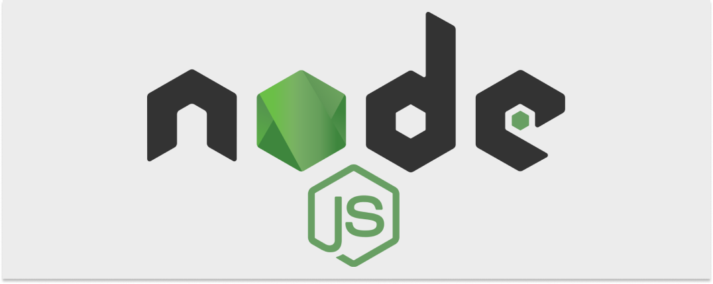

 </br>

![typescript][typescript]  

# Tazama Demo Application</br>
>
> [!NOTE]
> **[`Tazama`](https://tazama.org/index.html)** Open Source Real-Time Transaction Monitoring Software for Fraud and Money Laundering Detection

![GitHub License][github-license-badge] </br>

>
Welcome to the Tazama Demo Application. This demo app is used to demo the Tazama Open Source Real-Time Transaction Monitoring System built to support any Financial Services Provider (FSP) that requires Transaction Monitoring for Fraud and Money Laundering detection. Whether that FSP is a small provider running one or 2 transactions per day or a national payment switch running at over 3,000 Transactions per second. With Tazama they can implement simple or complex rules, implement Fraud Detection controls or support Anti-Money Laundering activities. 🌍

## Requirements

What you need:

-  **[Full-Stack-Tazama-Docker](https://github.com/tazama-lf/Full-Stack-Docker-Tazama)** - Setup the Rules and Typologies Using Docker Compose from the Tazama Repository. Follow the instructions in the readme.md
- 💻 **[Demo UI](#)** - Clone this repository and use the easy to setup UI to demo the Tazama Open Source Real-Time Transaction Monitoring System that dynamically builds the UI based on the configured rules and typologies

## Table of Contents

- [Tazama Demo Application](#tazama-demo-application)
  - [Requirements](#requirements)
  - [Table of Contents](#table-of-contents)
  - [Getting Started](#getting-started)
    - [Local Setup](#local-setup)
    - [Network Setup](#network-setup)
    - [Setup UI](#setup-ui)
    - [Settings Screen](#settings-screen)
  - [Tag and Release](#tag-and-release)
    - [Versioning](#versioning)
    - [Tag, Build and Push to Docker Hub](#tag-build-and-push-to-docker-hub)
    - [Reverting version changes if the build fails](#reverting-version-changes-if-the-build-fails)
    - [Create Docker Image for Dev Testing](#create-docker-image-for-dev-testing)
  - [License](#license)
  - [Contributors](#contributors)

## Getting Started

### Local Setup

To get started by running the demo locally, follow these steps:

1. Fork & clone repository:

```bash
## Don't forget to ⭐ star and fork it first :)
git clone git@github.com:tazama-lf/tazama-demo.git
```

2. Setup

```bash
add your GH_TOKEN to the .npmrc file ${GH_TOKEN}
```

3. Install the dependencies:

```bash
yarn install --frozen-lockfile
```

4. Create a new .env file and copy the contents of the `env_sample` file to the newly created .env

```text
NODE_ENV=dev
NEXT_PUBLIC_URL="http://localhost:3001"
PORT="3001"
NEXT_PUBLIC_TMS_SERVER_URL="http://localhost:5000"
NEXT_PUBLIC_TMS_KEY="no_key_set"
NEXT_PUBLIC_CMS_NATS_HOSTING="nats://localhost:14222"
NEXT_PUBLIC_NATS_USERNAME=""
NEXT_PUBLIC_NATS_PASSWORD=""
NEXT_PUBLIC_ARANGO_DB_HOSTING="http://localhost:18529"
NEXT_PUBLIC_DB_USER="root"
NEXT_PUBLIC_DB_PASSWORD=""
NEXT_PUBLIC_WS_URL="http://localhost:3001"

NEXT_PUBLIC_NATS_SUBSCRIPTIONS="['connection', '>', 'typology-999@1.0.0']"
```

5. Run the development server:

```bash
yarn dev
```

6. Open [http://localhost:3001](http://localhost:3001) with your browser to see the result.

<a><div align="right">[Top](#table-of-contents)</div></a>

### Network Setup

1. Follow the **[Full-Stack-Tazama-Docker](https://github.com/tazama-lf/Full-Stack-Docker-Tazama)** setup guide.
2. Add the following to the **[Full-Stack-Tazama-Docker](https://github.com/tazama-lf/Full-Stack-Docker-Tazama)** docker-compose.yaml found in the root directory

```yaml
demo:
    image: tazamaorg/demo-ui:v1.0.16
    env_file:
      - path: ./env/demo.env
        required: true
    restart: always
    depends_on:
      - tms
      - arango
      - nats
    ports:
      - '3001:3001'
```

> **Note* - Make sure to update the image to the most recent version
> tazamaorg/demo-ui:`{current_version}` eg: `v1.0.16`

3. Navigate to the `env` directory in the **[Full-Stack-Tazama-Docker](https://github.com/tazama-lf/Full-Stack-Docker-Tazama)** folder:

  ```text
  demo.env file:
# SPDX-License-Identifier: Apache-2.0

NODE_ENV=dev
NEXT_PUBLIC_URL="http://{server_ip_address}:3001"
PORT="3001"
NEXT_PUBLIC_TMS_SERVER_URL="http://{server_ip_address}:5000"
NEXT_PUBLIC_TMS_KEY=""
NEXT_PUBLIC_CMS_NATS_HOSTING="nats://nats:4222"
NEXT_PUBLIC_NATS_USERNAME=""
NEXT_PUBLIC_NATS_PASSWORD=""
NEXT_PUBLIC_ARANGO_DB_HOSTING="http://{server_ip_address}:18529"
NEXT_PUBLIC_DB_USER="root"
NEXT_PUBLIC_DB_PASSWORD=""
NEXT_PUBLIC_WS_URL="http://{your_machines_ip_address}:3001"

NEXT_PUBLIC_NATS_SUBSCRIPTIONS="['connection', '>', 'typology-999@1.0.0']"

  ```

4. From the **[Full-Stack-Tazama-Docker](https://github.com/tazama-lf/Full-Stack-Docker-Tazama)** directory run:

   ```bash
   docker compose pull demo
   ```

   then:
   ```bash
   docker compose up demo -d
   ```

5. Navigate to: [http://localhost:3001](http://localhost:3001)

6. To bring the demo container down run:

   ```bash
   docker compose down demo --remove-orphans
   ```

<a><div align="right">[Top](#table-of-contents)</div></a>

### Setup UI

1. First Load

>  <br/>

2. Click the gear icon on the top right for Settings

> <br/>

### Settings Screen

- TMS API Host URL: `http://localhost:5000`

  > **Check what port number is being used by the TMS server on the docker instance **(Default Port: 5000)***

- CMS NATS Hosting: `http://localhost:14222` if run outside of docker-compose else `nats://nats:4222`
  
  > **Check what port number is being used by the NATS server on the docker instance **(Default Port: 4222)***

- Arango DB Hosting: `http://localhost:18529`
  > **Check what port number is being used by the TMS server on the docker instance **(Default Port: 8529)***

- Websocket IP Address: `http://localhost:3001`
  > **If run locally use `http://localhost:3001` else if run on a network or hosted use `http://{your_ip_address}:3001` **(Default Port: 3001)***

<a><div align="right">[Top](#table-of-contents)</div></a>

## Tag and Release

### Versioning

> Format: v1.0.16
> 
> Given a version number MAJOR.MINOR.PATCH, increment the:
>
> MAJOR version when you make incompatible API changes,
MINOR version when you add functionality in a backwards-compatible manner, and PATCH version when you make backwards-compatible bug fixes. Additional labels for pre-release and build metadata are available as extensions to the MAJOR.MINOR.PATCH format.

In this section the following script will update the `PATCH` version in the package.json file and update the docker-compose.dev.yml file.

<a><div align="right">[Top](#table-of-contents)</div></a>

### Tag, Build and Push to Docker Hub

1. From the root of the project directory run:

   ```bash
   sudo chmod +x ./tag.sh
   ```

2. When you are ready to create a new image, run `./tag.sh` from the command line.

   ```bash
   ./tag.sh
   ```
  
   > **This will build the Docker Image and Push it to Docker Hub*

<a><div align="right">[Top](#table-of-contents)</div></a>

### Reverting version changes if the build fails

If the build fails run the following script to revert changes made to the `docker-compose.dev.yml` and the `package.json` files.

1. From the root of the project directory run:

   ```bash
   sudo chmod +x ./revertTag.sh
   ```

2. When you are ready to create a new image, run `./tag.sh` from the command line.

   ```bash
   ./revertTag.sh
   ```

3. Fix the build issues and run the `./tag.sh` script again to Tag and Release the Demo

<a><div align="right">[Top](#table-of-contents)</div></a>

### Create Docker Image for Dev Testing

1. Build the Docker image

   ```bash
   COMPOSE_DOCKER_CLI_BUILD=1 DOCKER_BUILDKIT=1 docker compose -f docker-compose.dev.yml build
   ```

2. Tag the Docker Image

   ```bash
   docker tag tazamaorg/demo-ui:{version} tazamaorg/demo-ui:{version}-dev
   ```

   > **Note: Check The `docker-compose.dev.yml` file to see what the version will be and update above command by replacing {version} with eg. v1.0.16*
3. Push the image to docker hub

   If you want to push the Docker image to Dockerhub for a distribution and testing:

   ```bash
   docker push tazamaorg/demo-ui:{version}-dev
   ```

   > **Note: Check The `docker-compose.dev.yml` file to see what the version will be and update above command by replacing {version} with eg. v1.0.16*

4. To use the Docker Image in the **[Full-Stack-Tazama-Docker](https://github.com/tazama-lf/Full-Stack-Docker-Tazama)** stack, update the following:

    ```yaml
    demo:
      image: tazamaorg/demo-ui:{version}-dev
      env_file:
        - path: ./env/demo.env
          required: true
      restart: always
      depends_on:
        - tms
        - arango
        - nats
      ports:
        - '3001:3001'
    ```

    > **Note: Check The `docker-compose.dev.yml` file to see what the version will be and update above command by replacing {version} with eg. v1.0.16*

<a><div align="right">[Top](#table-of-contents)</div></a>

## License

This project is licensed under the Apache License Version 2.0. For more information, see the [LICENSE](./LICENSE) file.

## Contributors

<!-- prettier-ignore-start -->
<!-- markdownlint-disable -->
<table>
  <tbody>
    <tr>
      <td align="center" valign="top" width="14.28%"><a href="https://github.com/KamikaziD"><br /><sub><b>Detmar Ruhfus</b></sub></a><br />💻 📖</td>
       <td align="center" valign="top" width="14.28%"><a href="https://github.com/paul-vz"><br /><sub><b>Paul Von Zeuner</b></sub></a><br />💻</td>
      <td align="center" valign="top" width="14.28%"><a href="https://github.com/sahra-amir"><br /><sub><b>Sahra Amir</b></sub></a><br />💻</td>
      <td align="center" valign="top" width="14.28%"><a href="https://github.com/Oliver-AO-GH"><br /><sub><b>Oliver Vermeulen</b></sub></a><br />💻</td>
    </tr>
  </tbody>
  <tfoot>
    <tr>
      <td align="center" size="13px" colspan="7">
        
          <a href="https://all-contributors.js.org/docs/en/bot/usage">Add your contributions</a>
        </img>
      </td>
    </tr>
  </tfoot>
</table>

<a><div align="right">[Top](#table-of-contents)</div></a>
<!-- markdownlint-restore -->
<!-- prettier-ignore-end -->

<!-- ALL-CONTRIBUTORS-LIST:END -->

<!-- Badges and links -->

[typescript]: https://img.shields.io/badge/TypeScript-007ACC?style=for-the-badge&logo=typescript&logoColor=white
[github-license-badge]: https://img.shields.io/github/license/tazama-lf/tazama-demo?link=https%3A%2F%2Fgithub.com%2FBlazity%2Fnext-enterprise%2Fblob%2Fmain%2FLICENSE
